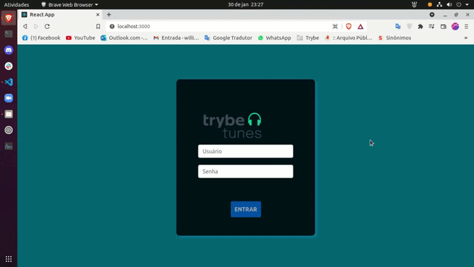

### Observação

Este repositório contem o **Projeto React TrybeTunes** que reúne o aprendizado desenvolvido por _[Willian Alves Batista](https://www.linkedin.com/in/willian-alves-batista-60aa6a180/)_ enquanto estudante da [Trybe](https://www.betrybe.com/) :rocket:
**GitHub [Trybe](https://github.com/tryber)**.

# Projeto TrybeTunes

### Resultado obtido:

### Deploy/ github pages do Projeto: [TrybeTunes](https://willianbatist.github.io/project-react-trybetunes/)

#### Habilidades que foram exigidas:

  - Fazer requisições e consumir dados vindos de uma `API`;
  - Utilizar os ciclos de vida de um componente React;
  - Utilizar a função `setState` de forma a garantir que um determinado código só é executado após o estado ser atualizado;
  - Utilizar o componente `BrowserRouter` corretamente;
  - Criar rotas, mapeando o caminho da URL com o componente correspondente, via `Route`;
  - Utilizar o `Switch` do `React Router`;
  - Usar o componente `Redirect` pra redirecionar para uma rota específica;
  - Criar links de navegação na aplicação com o componente `Link`;

---

## Apresentação do Projeto

### Introdução

O Projeto TrybeTunes é uma aplicação web, que busca recriar um serviço simples de streaming de música. Nesse projeto, foram utilizadas algumas tecnologias como ReactJS, React Router Dom, CSS e a API do Itunes, que permite acesso aos álbuns de cantores e bandas e reprodução de 30 segundos de cada faixa do álbum. No TrybeTunes, coloco em prática o meu aprendizado de react, que me facilita a criar páginas mais complexas com uma ótima definição de responsividade entre os componentes.

### src/pages/Login.js

  A tela inicial da aplicação web é a rota “/”, interface de login do usuário, onde no momento em que a pessoa clicar no botão “ENTRAR” o nome de usuário é salvo no localStorage. No entanto, só é possível clicar em entrar se o campo usuário for preenchido. Depois do clique, a página é redirecionada para a rota “/search”, no qual é renderizado o componente page Search.js.

### src/pages/Search.js

Depois da tela de login, as outras interfaces renderizam o componente Header, que contém o menu de navegação e apresenta na tela o nome do usuário. A page Search é o local onde a pessoa usuária digita o nome do artista na barra de pesquisa e clica no botão pesquisar, nesse momento é feita a requisição à API do Itunes para buscar álbuns disponíveis do artista ou banda solicitada. Com o retorno da API realizado, as informações dos álbuns são renderizadas na tela de forma dinâmica.

Após a pesquisa e os álbuns renderizados na tela é possível escolher algum e clicar para poder ouvir prévias das faixas do álbum, nesse caso a pessoa usuária é levada para outra rota “/album/:id” (:id é substituído pelo id do álbum escolhido), onde agora é renderizado com componente pages Album.js.

### src/pages/Album.js

Na tela de Álbum, as informações do álbum continuam e agora a api é chamada para trazer as faixas do álbum selecionado. Com as faixas renderizadas na tela, é possível selecionar as músicas favoritas a partir do checkbox, as músicas ficam salvas no localStorage e ao recarregar a página os favoritos continuam marcados.

#### Conclusão

O Projeto TrybeTunes ainda está em desenvolvimento e melhoria, a página de favoritos e Perfil ainda serão criadas. Seguindo metodologia ágeis, pequenas partes estão sendo entregues para que possa receber feedbacks e sofrer melhorias mais rápidas e entender se está indo no caminho certo ou não. O desafio, de realizar esse projeto, me ajudou a alavancar minhas hard skills de reactJS e melhorar consideravelmente minha lógica de programação.
  

### Trybe

_"A Trybe é uma escola do futuro para qualquer pessoa que queira melhorar de vida e construir uma carreira de sucesso em tecnologia, onde a pessoa só paga quando conseguir um bom trabalho."_
